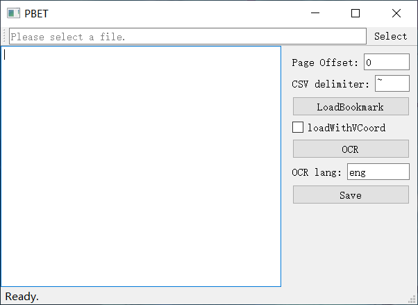

# PDFBookmarkII

A(nother) tool for edit bookmarks in PDF file.  
But this one support ORC feature.(YeahYeahYeah~)  
However, you must first install tesseract to use the OCR feature.(NoNoNo~)  

## Screenshot


## Usage

1. Select the pdf file you want to edit.
2. (optional) Load existing bookmarks.
3. (optional) Use OCR to get book catalog.
4. Edit bookmarks. (Format details see below.)
5. (optional) Set page number offset.
6. Click 'Save'. The name of the new file is '(*your file*)-new.pdf' .  
   **Note that if a file with the same name exists, the save button will overwrite it without any warning!**

## Bookmark Format

It's actually just CSV format, very simple.  
Each column is separated by a CSV delimiter.(The default delimiter is '~'.) 

For example, By default you will see something like the following:
```
1~I am title~1
2~I am subtitle~1
1~I am another title~2
```
The first column is the level.  
The second column is the title.  
The third column is the page number.  

There is also an optional fourth column that records a vertical coordinates on the page.  
But this coordinate is recorded in points, so it is difficult to add manually.  

Note that when the title contains a delimiter, the program obviously cannot parse it correctly.  
You need to choose to use another delimiter.  

This tool uses pymupdf to manipulate pdf files, check out these links if you want more details.  
[get_toc](https://pymupdf.readthedocs.io/en/latest/document.html#Document.get_toc)  
[set_toc](https://pymupdf.readthedocs.io/en/latest/document.html#Document.set_toc)  

## ORC Feature

As mentioned before, you have to install [tesseract](https://github.com/tesseract-ocr/tesseract) to use the OCR feature.  
Versions for win32 can be found [here](https://github.com/UB-Mannheim/tesseract/wiki) and [here](https://links.jianshu.com/go?to=https%3A%2F%2Fdigi.bib.uni-mannheim.de%2Ftesseract%2F).  

Once you install it, you need to click the OCR button to tell this tool where ***tesseract.exe*** is.  
Then set the language you want to recognize and you're good to go. (Just click the OCR button again.)

If you missed downloading language packs during installation, you can find them at this [link](https://github.com/tesseract-ocr/tessdata).  
Download and put them in ```(your tesseract installation directory)/tessdata```.

If you want to recognize multiple languages, just enter ```[first language code]+[second language code]+...``` in the language input box.  
Language codes can be found in this [document](https://github.com/tesseract-ocr/tessdoc/blob/main/Data-Files-in-different-versions.md).

The recognition of the ocr tool may not be successful every time, and it may take several attempts.

## Other

The new file may lose some metadata, Check out this [document](https://docs.python.org/3/library/shutil.html) for more details.  
